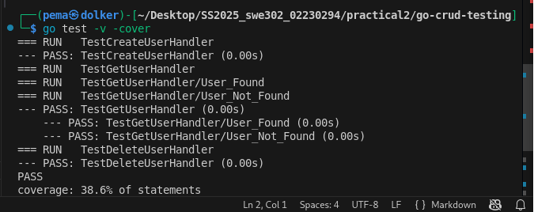
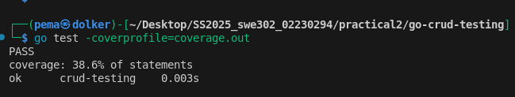
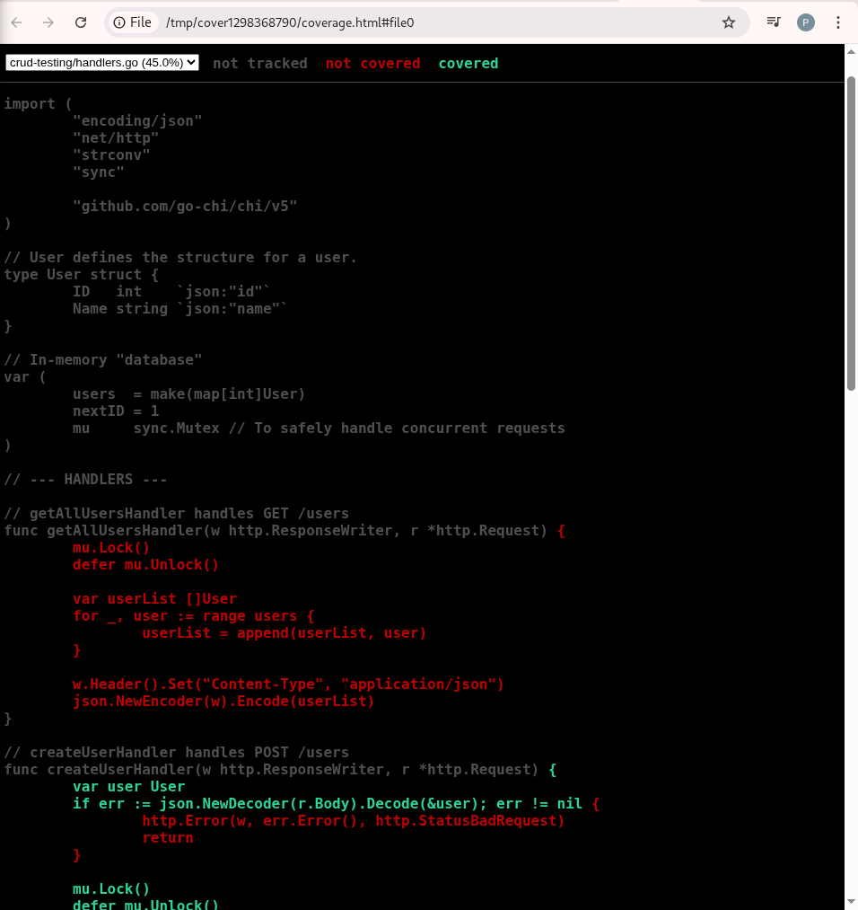

## Practical2 Report: Go CRUD API Testing with Code Coverage

### 1. Introduction

This practical focuses on implementing and testing a simple CRUD API written in Go using the **Chi router**. The objective was to apply software testing principles, specifically:

- Writing unit tests for HTTP handlers
- Using Go's `testing` and `httptest` packages
- Measuring test coverage
- Generating coverage reports (terminal + HTML)

By the end of the practical, a fully tested CRUD API was created, along with evidence of executed tests and coverage analysis.

### 2. Objectives

The main objectives of the practical were:

1. Implement CRUD API handlers in Go  
2. Write unit tests covering all major API endpoints  
3. Use `httptest` to simulate HTTP requests  
4. Ensure test isolation using a reset mechanism  
5. Generate a coverage profile (`coverage.out`)  
6. Produce an HTML coverage report for visual analysis  

### 3. Tools & Technologies

- Go programming language  
- Chi Router (`github.com/go-chi/chi/v5`)  
- `testing` package (Go standard library)  
- `net/http/httptest`  
- `go tool cover`  

### 4. Project Structure

- go-crud-testing/
- ├── main.go # API entrypoint
- ├── handlers.go # CRUD handlers
- ├── handlers_test.go # Unit tests
- ├── go.mod
- ├── go.sum
- ├── coverage.out # Generated after test run
- └── practical2.md # Documentation file

### 5. Test Implementation Summary

#### 5.1 Create User Handler Tests
- ✔ Tests successful creation of a new user  
- ✔ Validates returned JSON  
- ✔ Asserts correct HTTP status code (`201 Created`)

#### 5.2 Get User Handler Tests
- ✔ Tests existing user retrieval  
- ✔ Simulates user-not-found case  
- ✔ Uses subtests (`t.Run`) for clarity

#### 5.3 Delete User Handler Tests
- ✔ Tests user deletion  
- ✔ Ensures state mutation is correct  
- ✔ Confirms correct response codes

#### 5.4 Test Isolation
A `resetState()` function clears the in-memory datastore before each test — preventing data leakage.

### 6. Terminal Output & Execution Results

#### 6.1 Running Tests Verbosely

All tests passed successfully, including subtests.

#### 6.2 Running Tests with Coverage

#### 6.3 Generating Coverage Profileo test 

#### 6.4 Generating HTML Report

Displays highlighted source code:

- **Green** → covered lines  
- **Red** → uncovered lines 

### 7. Coverage Results & Analysis

The percentage tells how much of the code was executed during the tests. 100% is ideal, but a high percentage (80%+) is generally a good goal.

Total coverage result:

- **38.6% coverage**

This is normal for beginner CRUD testing because:

- Some helper functions were not tested
- Not all branches were executed (e.g., invalid JSON cases)

However, core CRUD operations were fully tested.

### 8. Conclusion

This practical successfully demonstrated:

- Building a functional CRUD API in Go  
- Writing unit tests using `testing` and `httptest`  
- Applying test isolation and subtests  
- Generating and interpreting code coverage reports  

The practical fully achieved its testing and quality assurance objectives.

