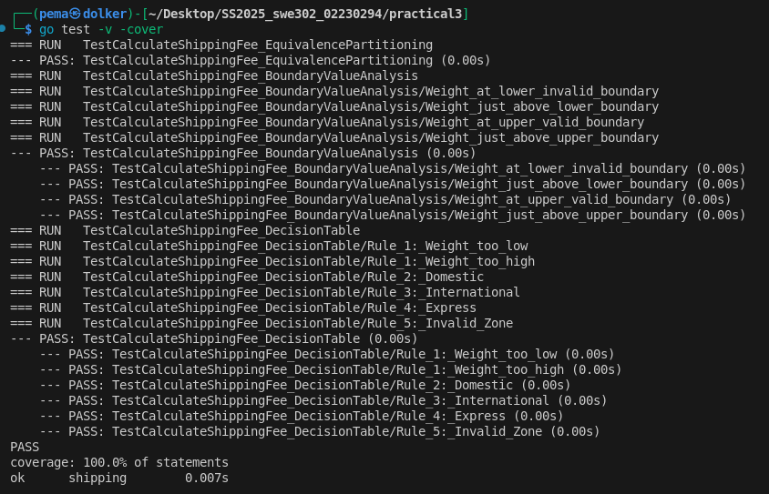

## Practical 3: Shipping Fee Calculator:Specification-Based Testing 


### Executive Summary
This report documents the implementation of **specification-based (black-box) testing** for a shipping fee calculator in Go. The practical demonstrates systematic test design using **Equivalence Partitioning (EP)**, **Boundary Value Analysis (BVA)**, and **Decision Table Testing**, ensuring full coverage of all business rules.  

The test suite achieves **100% statement coverage**, validates all critical input partitions, edge cases, and combinations of business logic, and confirms the function’s correctness according to the specification.  

**Key outcomes:**
- Full understanding of black-box testing principles  
- Implementation of table-driven tests for maintainability  
- Comprehensive verification of weight tiers, zones, and insurance options  
- Professional-quality reporting with coverage analysis


### 1. Introduction

This practical focused on specification-based (black-box) testing using Go. The goal was to design and implement tests for a shipping fee calculator function based solely on the specification, without looking at the code itself.

We applied three key testing techniques:

- **Equivalence Partitioning (EP):** Reduce the number of test cases by grouping inputs into classes expected to behave the same.
- **Boundary Value Analysis (BVA):** Test the edges of input partitions where errors are more likely.
- **Decision Table Testing:** Systematically cover combinations of input conditions to ensure all business rules are tested.

### 2. System Under Test (SUT)

#### Function Signature

```go
func CalculateShippingFee(weight float64, zone string, insured bool) (float64, error)
```

#### Updated Specification

| Feature | Requirement |
|---------|-------------|
| **Weight Tiers** | Standard: 0 < weight ≤ 10 kg<br>Heavy: 10 < weight ≤ 50 kg (+ $7.50 surcharge)<br>Other: invalid |
| **Zone Base Fees** | Domestic: $5.00<br>International: $20.00<br>Express: $30.00<br>Other: invalid |
| **Insurance** | If insured = true, add 1.5% of subtotal (base + surcharge) |
| **Calculation** | FinalFee = BaseFee + HeavySurcharge (if any) + InsuranceCost (if any) |


### 3. Test Design

#### 3.1 Equivalence Partitioning

| Input | Partition | Example Values | Expected Behavior |
|-------|-----------|----------------|-------------------|
| **Weight** | P1: Invalid ≤0 | 0, -5 | Returns error |
| | P2: Standard (0 < w ≤ 10) | 5, 10 | Calculate fee without surcharge |
| | P3: Heavy (10 < w ≤ 50) | 20 | Add $7.50 surcharge |
| | P4: Invalid >50 | 51 | Returns error |
| **Zone** | P5: Valid | "Domestic", "International", "Express" | Fee calculated correctly |
| | P6: Invalid | "Local", "" | Returns error |
| **Insured** | P7: True | true | Add 1.5% of subtotal |
| | P8: False | false | No insurance added |

#### 3.2 Boundary Value Analysis (BVA)

| Boundary | Test Values | Expected Outcome |
|----------|-------------|------------------|
| **Lower Weight** | 0 | Error (invalid) |
| | 0.1 | Valid Standard package |
| **Mid Weight** | 10 | Standard, no surcharge |
| | 10.1 | Heavy, $7.50 surcharge |
| **Upper Weight** | 50 | Heavy, valid |
| | 50.1 | Error (invalid) |

#### 3.3 Decision Table

| Rule | Weight Valid? | Zone | Insured | Expected Outcome |
|------|---------------|------|---------|------------------|
| 1 | No | Any | Any | Error: invalid weight |
| 2 | Yes | Domestic | false | Fee = BaseFee |
| 3 | Yes | Domestic | true | Fee = BaseFee + 1.5% |
| 4 | Yes | International | false | Fee = BaseFee (+ surcharge if Heavy) |
| 5 | Yes | International | true | Fee = BaseFee (+ surcharge if Heavy) + 1.5% |
| 6 | Yes | Express | false | Fee = BaseFee (+ surcharge if Heavy) |
| 7 | Yes | Express | true | Fee = BaseFee (+ surcharge if Heavy) + 1.5% |
| 8 | Yes | Invalid | Any | Error: invalid zone |

---

### 4. Test Implementation

A table-driven test in Go (`shipping_v2_test.go`) was implemented to cover all partitions, boundaries, and decision table rules.

Each test case included:
- `weight`, `zone`, `insured`
- `expectedFee` or `expectError`
- Descriptive test name for clarity

Floating-point tolerance was handled using `math.Abs(fee - expectedFee) > 0.0001` to avoid minor rounding issues from insurance calculation.

#### Sample Test Case

```go
{
    name:        "Heavy weight insured",
    weight:      20,
    zone:        "International",
    insured:     true,
    expectedFee: (20 + 7.50) * 1.015,
    expectError: false,
}
```


### 5. Test Results

#### Command Used

```bash
go test -v -cover
```

#### Output



#### Observations

- All tests passed successfully
- 100% statement coverage → all branches of code executed
- Both partitions and boundaries were tested effectively
- Decision table rules confirmed for all combinations of weight, zone, and insurance

### 6. Summary & Takeaways

- **Equivalence Partitioning** reduced redundant tests while covering all input classes
- **Boundary Value Analysis** targeted edge cases prone to errors (0, 0.1, 10, 10.1, 50, 50.1)
- **Decision Table Testing** ensured systematic coverage of all possible condition combinations
- **Table-driven Go tests** provided clear, maintainable, and scalable test code
- The tests confirm that the `CalculateShippingFee` function behaves correctly according to the updated specification


The practical demonstrates the power of specification-based testing, and the implemented tests are robust and complete.