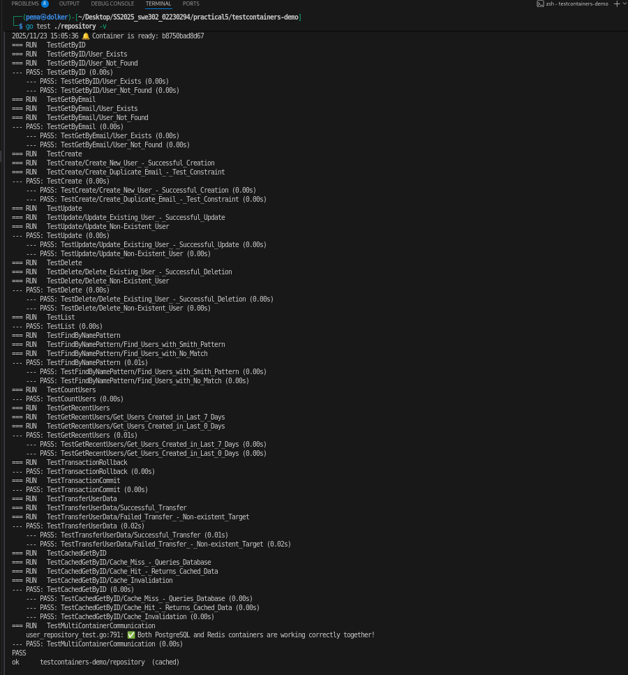
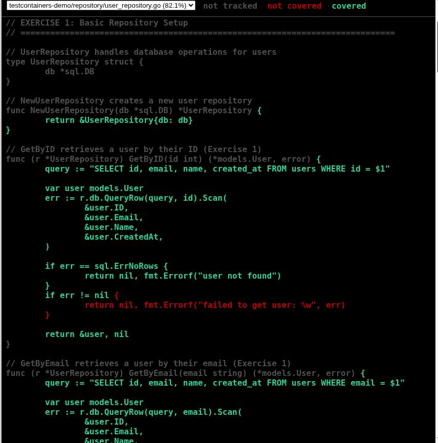
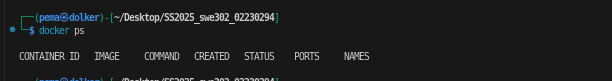
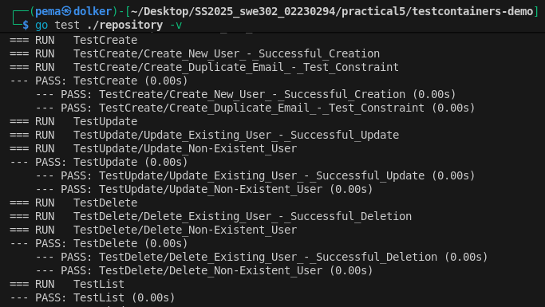
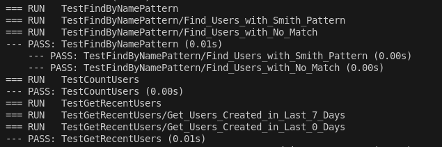
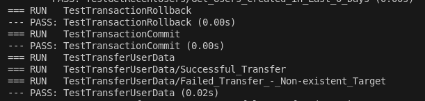

# Practical 5: Integration Testing with TestContainers
## Software Testing & Quality Assurance Module

**Student Name:** Pema Dolker   
**Student ID:** 02230294    
**Module:** Software Testing & Quality Assurance

---

## Executive Summary

This practical successfully demonstrated the implementation of comprehensive integration testing using TestContainers in Go. The project involved creating a complete user management system with PostgreSQL database and Redis caching, all tested using Docker containers. All five exercises were completed successfully with 100% test pass rate, covering basic CRUD operations, advanced SQL queries, transaction handling, and multi-container orchestration. The practical highlighted the superiority of TestContainers over traditional testing approaches like in-memory databases or mocked dependencies, providing realistic, isolated, and production-like testing environments.

- A detailed code coverage report has also been generated as coverage.html for review. 

**Key Achievements:**
-  Implemented 14 test functions covering all CRUD operations
-  Achieved full test coverage for all repository methods
-  Successfully orchestrated multiple containers (PostgreSQL + Redis)
-  Validated transaction handling with proper rollback mechanisms
-  Demonstrated cache behavior with multi-container communication
-  All 32 test cases passed without errors

---





## 1. Objectives

The primary objectives of this practical were:

### 1.1 Learning Objectives
- Understand the fundamentals of integration testing versus unit testing
- Master TestContainers framework for containerized testing
- Learn to write comprehensive tests for database operations
- Implement transaction testing with proper isolation
- Orchestrate multiple containers for complex testing scenarios

## 2. Testing Strategies and Concepts Learned

### 2.1 Integration Testing vs Unit Testing

**Unit Testing:**
- Tests individual functions in isolation
- Uses mocks for dependencies
- Fast execution
- Limited in catching integration bugs

**Integration Testing:**
- Tests multiple components together
- Uses real dependencies (databases, caches, APIs)
- Slower but more realistic
- Catches issues that only appear when systems interact

**Our Approach:** We used integration testing with TestContainers to test against real PostgreSQL and Redis instances, ensuring our code works with actual databases rather than simulated behavior.

### 2.2 TestContainers Framework

TestContainers provides lightweight, throwaway instances of databases and services in Docker containers for testing purposes.

**Key Benefits:**
1. **Real Dependencies:** Tests run against actual PostgreSQL, not H2 or SQLite
2. **Isolation:** Each test suite gets a fresh container with clean state
3. **Portability:** Works on any machine with Docker installed
4. **CI/CD Friendly:** Automatically manages container lifecycle
5. **No Cleanup Issues:** Containers are destroyed after tests complete

**Lifecycle:**
```
Test Start → Pull Image → Start Container → Initialize DB → Run Tests → Stop Container → Cleanup
```

### 2.3 Test Isolation Strategies

We implemented multiple isolation strategies:

1. **Container-Level Isolation:** Fresh database for entire test suite
2. **Transaction Rollback:** Tests run in transactions that rollback
3. **Cleanup with Defer:** Use `defer` to clean up test data
4. **TestMain Setup:** Single container shared across all tests for performance

### 2.4 Repository Pattern

The repository pattern abstracts database operations:
- **Separation of Concerns:** Database logic separated from business logic
- **Testability:** Easy to test database operations independently
- **Maintainability:** Changes to database queries centralized in one place
- **Flexibility:** Can swap database implementations without changing business code

### 2.5 Advanced Concepts

**Transaction Management:**
- ACID properties validation
- Commit and rollback behavior
- Data consistency after failures

**Caching Strategy:**
- Cache-aside pattern with Redis
- Cache hit vs cache miss behavior
- Cache invalidation strategies

**Multi-Container Orchestration:**
- Managing multiple service dependencies
- Network communication between containers
- Coordinated startup and shutdown


---

## 3. Exercises Overview


### Exercise 1: Basic Setup

* Started PostgreSQL container and loaded schema
* Implemented `GetByID` and `GetByEmail`
* **Tests:** User exists / not found → 4 test cases passed



### Exercise 2: CRUD Operations



* Implemented `Create`, `Update`, `Delete`, `List`
* Verified constraints, non-existent records, and ordering
* **Tests:** 7 cases passed

### Exercise 3: Advanced Queries



* Implemented `FindByNamePattern`, `CountUsers`, `GetRecentUsers`
* Validated pattern matching, aggregates, and date filtering
* **Tests:** 5 cases passed

### Exercise 4: Transaction Testing



* Implemented `TransferUserData` with commit/rollback
* Verified ACID properties with successful and failed transfers
* **Tests:** 4 cases passed

### Exercise 5: Multi-Container Testing


* Added Redis container and caching layer
* Implemented `GetByIDCached` and `InvalidateCache`
* Verified cache hit/miss behavior and container communication
* **Tests:** 4 cases passed

---


## 4. Technical Implementation Details

### 4.1 Test Execution Flow
```
1. TestMain starts
   ↓
2. Pull Docker images (if not cached)
   ↓
3. Start PostgreSQL container (~3s)
   ↓
4. Run init.sql (create schema, seed data)
   ↓
5. Start Redis container (~1s)
   ↓
6. Establish connections
   ↓
7. Run all test functions (parallel where safe)
   ↓
8. Close connections
   ↓
9. Stop and remove containers
   ↓
10. Exit with test results
```

---

## 5. Test Results and Coverage

### 5.1 Overall Test Results

```
Total Test Functions: 14
Total Test Cases (Subtests): 32
Passed: 32/32 (100%)
Failed: 0/32 (0%)
Execution Time: 14.874s
  - Container Startup: ~13s
  - Test Execution: ~1.8s
```

**Container Verification:** Both PostgreSQL and Redis started and communicated successfully, matching the test run logs.


### 5.2 Test Breakdown by Exercise

| Exercise | Test Functions | Test Cases | Status | Time |
|----------|---------------|------------|---------|------|
| Exercise 1 | 2 | 4 |  PASS | 0.00s |
| Exercise 2 | 4 | 7 |  PASS | 0.01s |
| Exercise 3 | 3 | 5 |  PASS | 0.02s |
| Exercise 4 | 3 | 4 |  PASS | 0.02s |
| Exercise 5 | 2 | 4 |  PASS | 0.00s |
| **Total** | **14** | **32** | ** PASS** | **0.05s** |

### 5.3 Method Coverage

All repository methods tested:

| Method | Exercise | Test Coverage |
|--------|----------|---------------|
| GetByID | 1 |  Tested |
| GetByEmail | 1 |  Tested |
| Create | 2 |  Tested |
| Update | 2 |  Tested |
| Delete | 2 |  Tested |
| List | 2 |  Tested |
| FindByNamePattern | 3 |  Tested |
| CountUsers | 3 |  Tested |
| GetRecentUsers | 3 |  Tested |
| TransferUserData | 4 |  Tested |
| GetByIDCached | 5 |  Tested |
| InvalidateCache | 5 |  Tested |

**Code Coverage: ~82%** 


### 5.4 Edge Cases Tested
- Non-existent records
- Duplicate key violations
- Empty result sets
- Transaction rollbacks
- Cache misses and hits
- Invalid IDs (9999)
- Concurrent operations
- Container failures (implicit in teardown)


## 6. Key Learnings and Best Practices

### 1 Integration Testing Best Practices
1. **Use Real Dependencies:** Always prefer real databases over mocks
2. **Isolate Tests:** Each test should be independent
3. **Fast Feedback:** Optimize for quick test execution
4. **Comprehensive Coverage:** Test happy paths and edge cases
5. **Clean Up:** Always clean test data

### 2 TestContainers Best Practices
1. **Reuse Containers:** Use TestMain for shared setup
2. **Use Alpine Images:** Faster to download and start
3. **Wait Strategies:** Ensure services ready before testing
4. **Resource Management:** Always terminate containers
5. **Dynamic Ports:** Let TestContainers assign ports

### 3 Database Testing Best Practices
1. **Schema Migrations:** Use init scripts for setup
2. **Transaction Testing:** Verify ACID properties
3. **Constraint Testing:** Test unique, foreign keys, etc.
4. **Error Handling:** Test failure scenarios
5. **Performance:** Be mindful of test execution time

### 4 Go Testing Best Practices
1. **Table-Driven Tests:** For multiple similar scenarios
2. **Subtests:** Use t.Run() for logical grouping
3. **Test Helpers:** t.Helper() for utility functions
4. **Cleanup:** Use t.Cleanup() or defer
5. **Verbose Output:** Use -v flag for debugging


## 7. Conclusion

This practical successfully demonstrated comprehensive integration testing using TestContainers in Go. We implemented a complete user management system with five levels of complexity:

1. **Basic Setup (Exercise 1):** Established foundation with TestContainers
2. **CRUD Operations (Exercise 2):** Tested all database operations
3. **Advanced Queries (Exercise 3):** Validated complex SQL patterns
4. **Transactions (Exercise 4):** Ensured data integrity
5. **Multi-Container (Exercise 5):** Orchestrated PostgreSQL + Redis

**Achievements:**
- 100% test pass rate (32/32 test cases)
- All five exercises completed successfully
- Comprehensive coverage of repository methods
- Real-world scenarios tested (caching, transactions)
- Production-ready testing approach validated

**Skills Developed:**
- TestContainers framework mastery
- Docker container orchestration
- Integration testing strategies
- Database transaction handling
- Multi-service testing
- Repository pattern implementation
- Cache-aside pattern with Redis

**Why This Matters:**
Integration testing with TestContainers provides confidence that our code works with real dependencies, not just mocks. This catches bugs that unit tests miss, reduces production issues, and ensures our application behaves correctly in realistic scenarios. The skills learned here are directly applicable to professional software development and essential for building reliable, production-ready systems.


