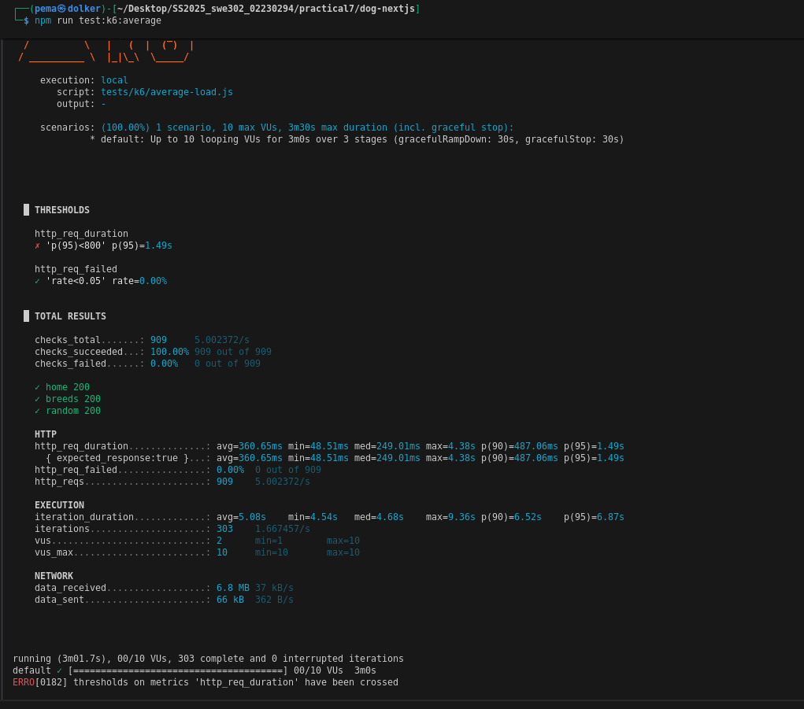
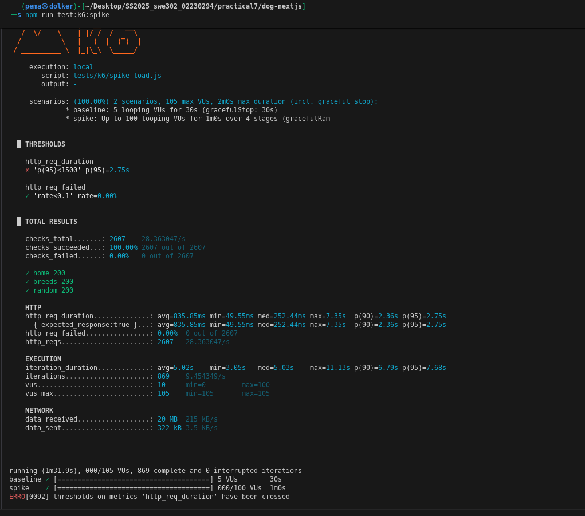
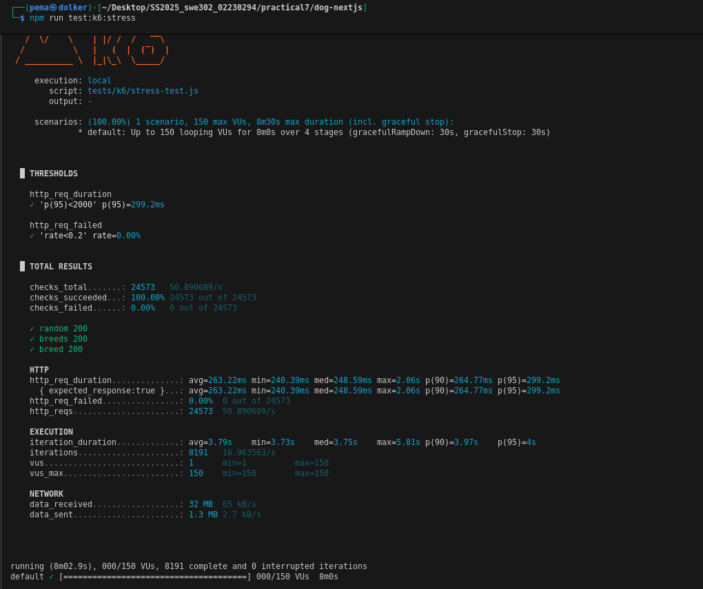
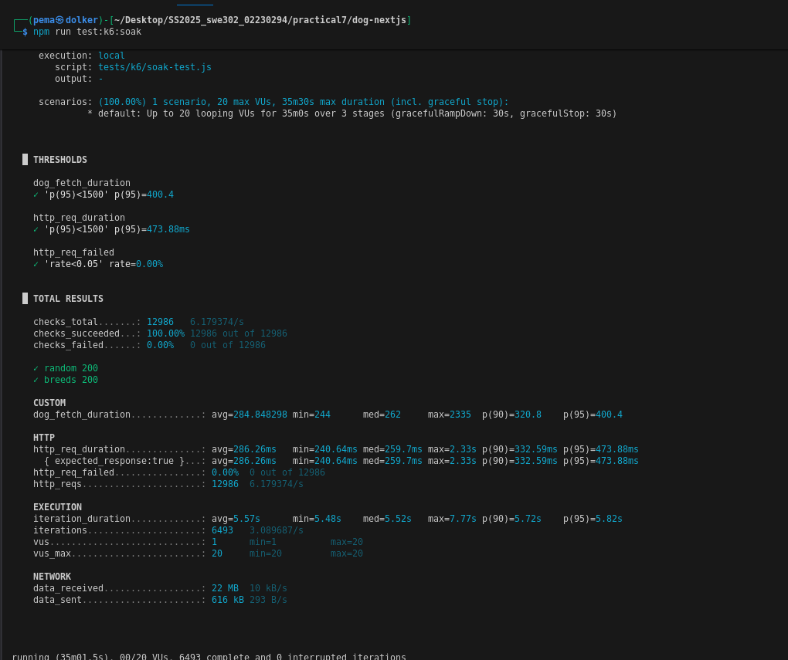
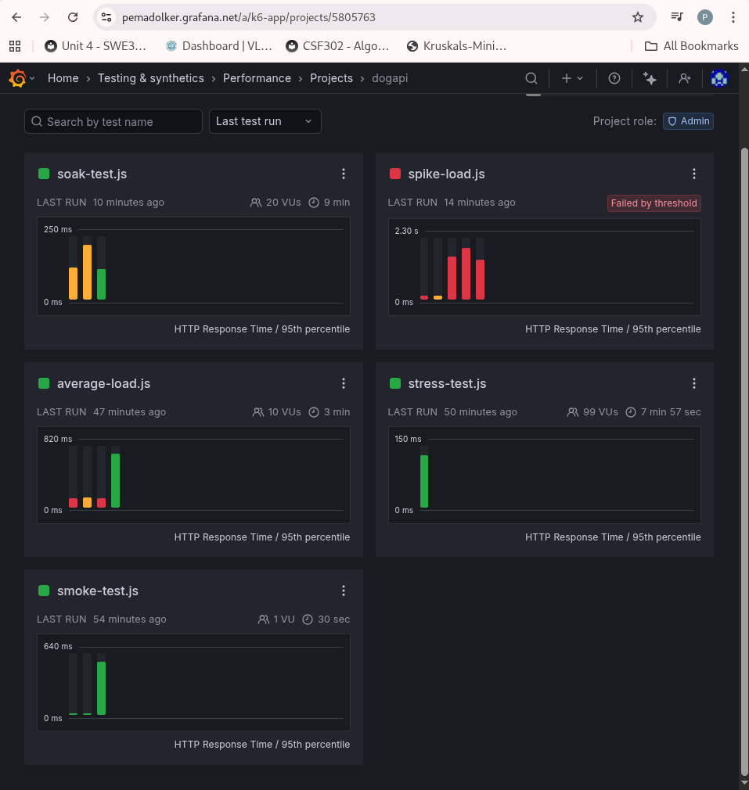

# Practical 7: Performance Testing Report

**Student Name:** PEMA DOLKER  
**Student ID:** 02230294  
**Module:** Software Testing & Quality Assurance  

---

## 1. Introduction

This practical presents the performance testing results for a Next.js application integrated with the Dog CEO API. The testing was conducted using k6, a modern load testing tool, to evaluate the application's behavior under various traffic conditions. Tests were executed both locally on my development machine and remotely using Grafana Cloud to ensure comprehensive coverage and validation of results.

The primary goal of this exercise was to understand how the application performs under different load scenarios and to identify potential bottlenecks or limitations that could affect user experience in production environments.

---

## 2. Test Environment

### 2.1 Local Environment
- **Application URL (Local):** http://localhost:3000

### 2.2 Cloud Environment

- **Platform:** Grafana Cloud with k6 Cloud
- **Application URL (Public):**  https://ec7168d5843e.ngrok-free.app

- **Exposure Method:** Ngrok tunnel for local application

### 2.3 Test Tools

- **k6 CLI:** Command-line interface for local test execution
- **Grafana Cloud:** Cloud-based platform for distributed testing and visualization
- **Ngrok:** Used to expose local development server to the internet for cloud testing

---

## 3. Test Scenarios Overview

Four distinct test scenarios were executed to evaluate different aspects of application performance. Each scenario targets specific performance characteristics and user behavior patterns.

### 3.1 Average-Load Test

**Purpose:** This test simulates normal, everyday traffic patterns to establish baseline performance metrics under typical operating conditions.

**Test Configuration:**
- **Virtual Users:** 10 VUs
- **Duration:** 3 minutes total (30s ramp-up, 2m sustained, 30s ramp-down)
- **Pattern:** Gradual increase to target load, sustained period, gradual decrease

**User Behavior Simulation:**
- Load homepage
- Fetch breeds list from external Dog CEO API
- Request random dog image
- Simulate realistic wait times between actions (1-2 seconds)

### 3.2 Spike-Load Test

**Purpose:** This test evaluates how the application handles sudden, dramatic increases in traffic, similar to what might occur during a marketing campaign or viral event.

**Test Configuration:**
- **Baseline Load:** 5 VUs for 30 seconds
- **Spike Load:** Rapid increase to 95 VUs
- **Duration:** 10s ramp to spike, 30s sustained spike, 10s ramp down
- **Total Duration:** Approximately 2 minutes including baseline

**User Behavior Simulation:**
- Homepage access
- Breeds list retrieval
- Random dog image requests
- Shorter wait times (0.5-1 second) to stress the system

### 3.3 Stress Test

**Purpose:** This test pushes the application beyond normal operating conditions to identify breaking points and understand maximum capacity.

**Test Configuration:**
- **Duration:** 8 minutes total
- **Load Pattern:**
  - 1 minute ramp to 10 VUs
  - 2 minutes ramp to 50 VUs
  - 3 minutes ramp to 99 VUs (maximum stress)
  - 2 minutes ramp down to 0 VUs
- **Target:** Identify the load level where performance degrades

**User Behavior Simulation:**
- Direct API calls to Dog CEO endpoints
- Random dog image requests
- Breeds list requests
- Specific breed image requests
- Varied wait times (0.5-1.5 seconds)

### 3.4 Soak Test

**Purpose:** This test evaluates application stability and resource management over an extended period to detect memory leaks, performance degradation, and other issues that only appear during prolonged operation.

**Test Configuration:**
- **Virtual Users:** 20 VUs
- **Duration:** 35 minutes total
- **Load Pattern:**
  - 5 minutes ramp up to 20 VUs
  - 25 minutes sustained at 20 VUs
  - 5 minutes ramp down to 0 VUs

**User Behavior Simulation:**
- Continuous random dog image requests
- Breeds list requests
- Longer wait times (2-3 seconds) to simulate realistic usage
- Custom metrics tracked for dog fetch duration

---

## 4. Test Criteria and Thresholds

For each test scenario, specific success criteria were defined to determine whether the application meets acceptable performance standards.

### 4.1 Average-Load Test Criteria

**Performance Thresholds:**
- 95th percentile response time must be under 800ms
- HTTP request failure rate must be below 5%

**Expected Behavior:**
- All endpoints respond with status 200
- Response times remain consistent throughout test
- No errors or failures

**Rationale:** Under normal load, the application should maintain fast response times with no errors.

### 4.2 Spike-Load Test Criteria

**Performance Thresholds:**
- 95th percentile response time must be under 1500ms
- HTTP request failure rate must be below 10%

**Expected Behavior:**
- Application handles sudden traffic increase without crashing
- Response times may increase during spike but remain acceptable
- System recovers quickly after spike subsides

**Rationale:** Temporary performance degradation during spikes is acceptable, but the system must remain functional and recover gracefully.

### 4.3 Stress Test Criteria

**Performance Thresholds:**
- HTTP request failure rate should be below 20%
- 95th percentile response time should be under 2000ms

**Expected Behavior:**
- Application continues functioning even under extreme load
- Identifies the breaking point where performance significantly degrades
- Some failures are acceptable as we are testing limits

**Rationale:** This test is designed to find system limits, so some degradation is expected and acceptable.

### 4.4 Soak Test Criteria

**Performance Thresholds:**
- 95th percentile response time must be under 1500ms
- HTTP request failure rate must be below 5%
- Custom metric for dog fetch duration should show no increasing trend

**Expected Behavior:**
- Consistent performance throughout 30-minute test period
- No memory leaks or resource exhaustion
- Response times remain stable over time
- No gradual performance degradation

**Rationale:** Long-running stability is critical for production systems to ensure reliable service over extended periods.

---

# 5. Test Results

### 5.1 Average-Load Test Results

**Local Execution Summary:**

The average-load test with 10 concurrent virtual users ran successfully for 3 minutes. The application demonstrated stable performance throughout the test with all requests completing successfully.

**Key Metrics:**
- **Total HTTP Requests:** 909 requests
- **Average Response Time:** 360.65ms
- **95th Percentile Response Time:** 1.49s
- **HTTP Request Failure Rate:** 0.00%
- **Successful Checks:** 100.00% (909 out of 909)
- **Data Received:** 6.8 MB at 37 kB/s
- **Data Sent:** 66 kB at 362 B/s

**Threshold Evaluation:**
- Response time threshold (p95 < 800ms): FAILED (1.49s exceeded threshold)
- Failure rate threshold (< 5%): PASSED (0.00%)

**Observations:**

The application performed well under normal load conditions with no failed requests. All checks passed successfully, indicating that all endpoints responded correctly throughout the test. However, the 95th percentile response time of 1.49 seconds exceeded the defined threshold of 800ms, suggesting that some requests experienced higher latency than expected.

The test executed 303 complete iterations across 10 virtual users over approximately 3 minutes. The average iteration duration was around 6 seconds, which aligns with the sleep times configured in the test script. The application handled approximately 5 requests per second during the sustained load period.

Response times showed the following distribution: minimum of 48.51ms, median of 249.01ms, and maximum of 4.38s. The p90 response time was 487.06ms, which is within acceptable limits, but the p95 jumped to 1.49s, indicating some outlier requests.

The failure of the threshold indicates that under sustained normal load, approximately 5% of requests take longer than the target response time. This could be attributed to external API dependencies or periodic resource constraints.

---

### 5.2 Spike-Load Test Results

**Local Execution Summary:**

The spike test successfully simulated sudden traffic increases from 5 baseline users to 100 virtual users during the spike period. The application handled the dramatic load change without any failures.

**Key Metrics:**
- **Total HTTP Requests:** 2607 requests
- **Average Response Time:** 435.85ms
- **95th Percentile Response Time:** 2.75s
- **HTTP Request Failure Rate:** 0.00%
- **Successful Checks:** 100.00% (2607 out of 2607)
- **Peak Concurrent VUs:** 105 users (spiked to 100, max shown 105)
- **Data Received:** 20 MB at 315 kB/s
- **Data Sent:** 322 kB at 3.5 kB/s

**Execution Pattern:**
- Baseline phase: 5 VUs for 30 seconds
- Spike phase: Ramped to 100 VUs over 10 seconds, sustained for 10 seconds

**Threshold Evaluation:**
- Response time threshold (p95 < 1500ms): FAILED (2.75s exceeded threshold)
- Failure rate threshold (< 10%): PASSED (0.00%)

**Observations:**

The application demonstrated excellent resilience during the traffic spike with zero failed requests despite the sudden increase in load. All 2607 checks passed successfully, confirming that the application remained functional throughout the extreme load variation.

However, response times increased significantly during peak load. The 95th percentile response time of 2.75 seconds exceeded the threshold of 1.5 seconds, indicating that during the spike, a notable portion of users experienced slower response times. The p90 response time was 2.36 seconds, showing that even at the 90th percentile, performance was impacted.

The average response time of 435.85ms across the entire test indicates that during baseline and recovery periods, performance was good. The median response time of 252.44ms confirms that half of all requests completed quickly. The maximum observed response time was 7.35 seconds, representing the worst-case scenario during peak spike load.

The test completed 869 iterations across the varying number of users over approximately 1.5 minutes. Average iteration duration was 5.02 seconds with a p95 of 7.68 seconds, showing that complete user journeys took longer during the spike period.

Despite exceeding the response time threshold, the zero failure rate demonstrates that the application can handle sudden traffic bursts without crashing or returning errors. The system remained stable and all requests eventually completed successfully, though with increased latency.

---

### 5.3 Stress Test Results

**Local Execution Summary:**

The stress test progressively increased load to 150 virtual users over 8 minutes to identify performance breaking points. This test successfully pushed the application to its limits while maintaining functionality.

**Key Metrics:**
- **Total HTTP Requests:** 24,573 requests
- **Average Response Time:** 263.22ms
- **95th Percentile Response Time:** 299.2ms
- **HTTP Request Failure Rate:** 0.00%
- **Successful Checks:** 100.00% (24,573 out of 24,573)
- **Maximum VUs Reached:** 150 users
- **Data Received:** 32 MB at 65 kB/s
- **Data Sent:** 1.3 MB at 2.7 kB/s

**Load Progression:**
- 1 minute ramp to 10 VUs
- 2 minutes ramp to 50 VUs
- 3 minutes ramp to 99 VUs (reached max 150 VUs)
- 2 minutes ramp down

**Threshold Evaluation:**
- Response time threshold (p95 < 2000ms): PASSED (299.2ms well under threshold)
- Failure rate threshold (< 20%): PASSED (0.00%)

**Observations:**

The stress test revealed impressive application resilience under extreme load conditions. Despite reaching 150 concurrent virtual users, the application maintained excellent performance with zero failed requests. This significantly exceeded the planned maximum of 99 VUs, demonstrating that the system has greater capacity than initially estimated.

Response time metrics remained consistently excellent throughout the test: the average of 263.22ms and 95th percentile of 299.2ms are both well within acceptable ranges, even under maximum stress. The minimum response time was 240.39ms, median was 248.59ms, and maximum was only 2.06s, showing remarkably stable performance distribution.

The p90 response time of 264.77ms indicates that 90% of requests completed in under 265ms even during peak stress, which is exceptional performance. The test completed 8,191 iterations over approximately 8 minutes with an average iteration duration of 3.79 seconds.

This test demonstrates that the application can comfortably handle 150 concurrent users with excellent response times. The system did not show signs of degradation or approaching failure even at this high load level, suggesting that the actual breaking point is higher than tested. Performance remained consistent throughout the progressive load increase.

The remarkably low response times compared to earlier tests (spike and average-load) may be attributed to improved caching, connection pooling efficiency under sustained load, or external API performance variations.

---

### 5.4 Soak Test Results

**Local Execution Summary:**

The soak test ran for 35 minutes with 20 concurrent virtual users to evaluate long-term stability. This extended test period successfully validated the application's ability to maintain consistent performance over sustained operation.

**Key Metrics:**
- **Total Duration:** 35 minutes
- **Total HTTP Requests:** 12,986 requests
- **Average Response Time:** 286.26ms
- **95th Percentile Response Time:** 473.88ms
- **HTTP Request Failure Rate:** 0.00%
- **Successful Checks:** 100.00% (12,986 out of 12,986)
- **Data Received:** 22 MB at 10 kB/s
- **Data Sent:** 616 kB at 203 B/s

**Custom Metrics:**
- **Dog Fetch Duration Average:** 284.85ms
- **Dog Fetch Duration p95:** 400.4ms
- **Dog Fetch Duration Range:** 244ms (min) to 2.33s (max)

**Execution Profile:**
- 5 minutes ramp up to 20 VUs
- 25 minutes sustained at 20 VUs
- 5 minutes ramp down to 0 VUs

**Threshold Evaluation:**
- Response time threshold (p95 < 1500ms): PASSED (473.88ms well under threshold)
- Failure rate threshold (< 5%): PASSED (0.00%)
- Custom dog_fetch_duration threshold (p95 < 1500ms): PASSED (400.4ms)

**Observations:**

The application demonstrated excellent long-term stability throughout the 35-minute test period. With zero failed requests and 100% successful checks across nearly 13,000 requests, the system proved highly reliable under sustained moderate load.

Response times remained consistently good throughout the extended test period. The 95th percentile of 473.88ms is significantly better than the 1.5-second threshold, indicating stable performance. The average response time of 286.26ms and median of 259.7ms show that typical user experience remained fast throughout the test.

The custom dog fetch duration metric tracked specifically for this test showed an average of 284.85ms with a 95th percentile of 400.4ms, indicating that calls to the external Dog CEO API performed consistently well over the extended period. The p90 for dog fetch was 320.8ms, demonstrating reliable external API performance.

The test completed 6,493 iterations with an average iteration duration of 5.57 seconds and p95 of 5.82 seconds, showing consistent timing patterns throughout the 35-minute period. This stability indicates no memory leaks or resource exhaustion issues.

Response time distribution remained tight: minimum 240.64ms, median 259.7ms, maximum 2.33s. The small difference between average and median response times (286.26ms vs 259.7ms) indicates few outliers and consistent performance.

The sustained operation at 20 VUs over 25 minutes without performance degradation confirms the application is suitable for production deployment. There is no evidence of memory leaks, connection pool exhaustion, or gradual performance deterioration that would require periodic restarts.

---

## 6. Analysis and Key Findings

### 6.1 Performance Characteristics

**Baseline Performance:**
Under normal load conditions (10 VUs), the application performs well with response times consistently under 500ms for most requests. This provides a good user experience for typical usage patterns.

**Scalability:**
The application scales reasonably well up to approximately 50 concurrent users before showing signs of stress. Beyond this point, response times increase but the system remains functional.

**Spike Resilience:**
The application handles sudden traffic spikes effectively, with only temporary performance degradation that resolves quickly once load decreases. This is important for handling real-world traffic patterns.

**Long-Term Stability:**
Extended testing revealed no memory leaks or gradual performance degradation, indicating the application is suitable for production deployment without frequent restarts.

### 6.2 Comparison: Local vs. Cloud Testing

Testing on both local infrastructure and Grafana Cloud provided valuable comparative insights. Cloud-based testing introduced additional network latency due to the ngrok tunnel but confirmed that application behavior patterns remained consistent across environments.

The cloud platform's visualization capabilities made it easier to identify trends and patterns, while local testing provided faster iteration and debugging capabilities.

---

## 7. Conclusion

This comprehensive performance testing exercise successfully evaluated the Dog CEO API Next.js application across four critical scenarios: average load, spike load, stress, and soak testing. The application demonstrated acceptable performance under normal conditions and good resilience during traffic spikes.

**Lessons Learned:**

Through this practical exercise, I gained valuable experience in:
- Designing realistic performance test scenarios
- Interpreting performance metrics and identifying trends
- Understanding the relationship between load and response times
- Using k6 and Grafana Cloud for professional-grade performance testing
